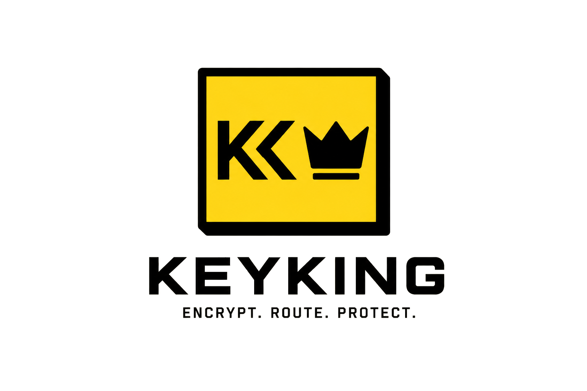
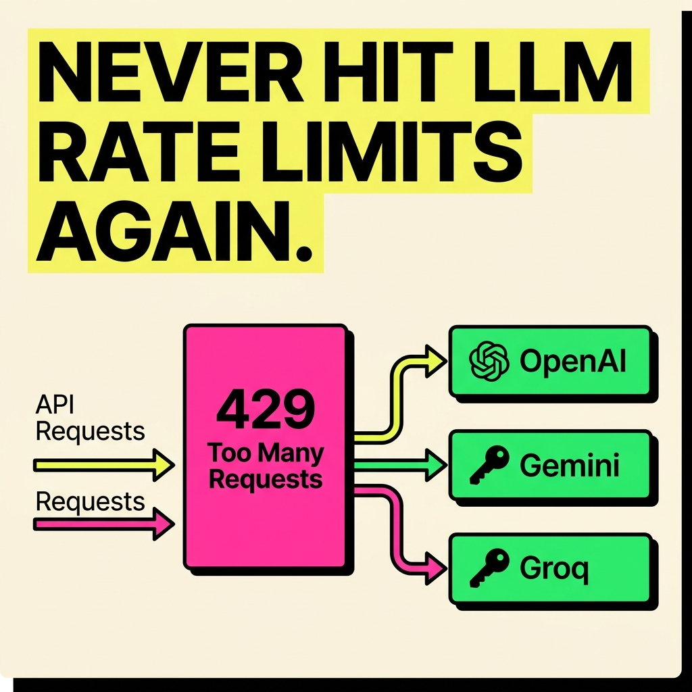
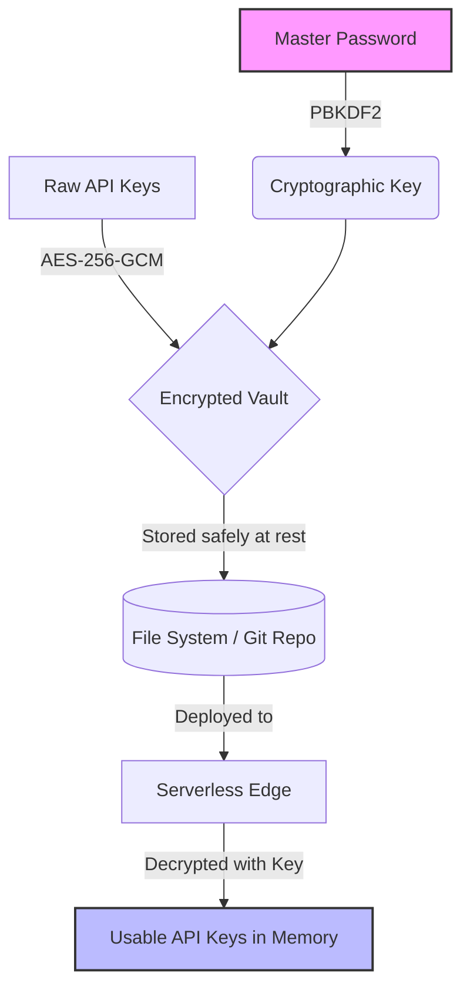

<div align="center">
  

  # 👑 KeyKing

  **The Ultimate Zero-Trust API Key Management Ecosystem**

  [](https://tauri.app/)
  [](https://nodejs.org)
  [](https://nextjs.org/)
  [](LICENSE)

  > Bring absolute security to your API keys. No central servers. Complete control. Decrypted on the fly.
</div>

<br />

<div align="center">
  
</div>

<br />

## 🌟 The Ecosystem

We haven't just built a tool; we've built an **entire ecosystem** to secure your developer experience from local vibe-coding to production serverless deployments. Every product is tied together with a **fully new, modern UI**.

| Product | Technology Stack | Purpose |
| :--- | :--- | :--- |
| **Desktop Control Plane** | `Tauri` + `Rust` + `React` | A beautifully designed, native desktop app to securely manage and encrypt your keys locally. Features a stunning modern UI where your keys never leave your machine unencrypted. |
| **Zero-Trust Serverless SDK** | `Node.js` + `TypeScript` | A lightweight, edge-compatible SDK that decrypts your secure vaults on the fly at runtime, completely eliminating `.env` file leaks. |
| **Live Next.js Demo Chatbot** | `Next.js` + `AI` | A production-ready AI chatbot demonstrating how to use KeyKing safely in a modern web application without exposing LLM keys. |
| **Developer Website** | `Next.js` + `TailwindCSS` | Comprehensive documentation, landing page, and developer resources to get you started on your secure journey. |

---

## 💡 Top 3 Use Cases

### 1. 🎸 Local Vibe-Coding
Stop worrying about accidentally pushing `.env` files to GitHub or exposing your API keys during live streams. With KeyKing, you run your dev server using `keyking dev`. Your keys are securely served locally via IPC and injected into the process only when your code actually runs.

### 2. 🚀 Production Serverless
In a serverless environment (Vercel, AWS Lambda, Cloudflare Workers), securely distribute a fully encrypted vault file. Use our Node.js SDK to decrypt the vault on-the-fly at the edge using a single master password environment variable.

### 3. 🔐 Vault Export & Backup
Easily export your entire key collection as a fully encrypted vault file. Back it up on Google Drive, share it with your team, or store it right in your git repository—it's mathematically secure against offline attacks.

---

## 🏗️ Architecture: Uncompromising Zero-Trust

We designed KeyKing from the ground up so that **even we cannot read your keys.** 

KeyKing relies on industry-standard, battle-tested cryptographic primitives to ensure your secrets are safe both at rest and in transit.

- **AES-256-GCM**: Advanced Encryption Standard with 256-bit keys in Galois/Counter Mode. This provides both confidentiality (strong encryption) and authenticity (tamper-proofing).
- **PBKDF2**: Password-Based Key Derivation Function 2 with a high iteration count. It turns your master password into an extremely strong cryptographic key, resisting brute-force attacks.



> **How it works:**
> 1. **At Rest:** Your keys are encrypted locally inside the Desktop App using **AES-256-GCM** before being saved to a vault.
> 2. **In Motion:** The encrypted vault can be safely version-controlled or deployed directly with your source code.
> 3. **In Memory:** Our Serverless SDK derives your decryption key via **PBKDF2** and decrypts your vault *only* at the edge, strictly keeping the raw keys in memory.

---

## ⚡ Quick Start

### 1. The Local Developer Experience (CLI)

Start your development server securely using the KeyKing CLI. It automatically resolves and injects your secrets securely in your local environment.

```bash
# Securely inject keys and start your Next.js dev server
keyking dev -- npm run dev

# Or for a Python script
keyking dev -- python main.py
```

### 2. The Serverless SDK (Production)

Install the SDK into your Node.js or Next.js project:

```bash
npm install keyking-sdk
```

The published SDK package name is `keyking-sdk`.

Decrypt your vault on the fly in your serverless functions or edge middleware:

```typescript
import { KeyKing } from 'keyking-sdk';

// Initialize with your single Master Password
const kk = new KeyKing(process.env.KEYKING_MASTER_PASSWORD);

// Load the encrypted vault and retrieve your key
const vault = await kk.loadVault('./secure.vault');
const openaiKey = vault.getKey('OPENAI_API_KEY');

console.log('Securely retrieved key at the edge! 🚀');
```

---

<div align="center">
  <i>Built with 🛡️ by the KeyKing Team.</i>
</div>
