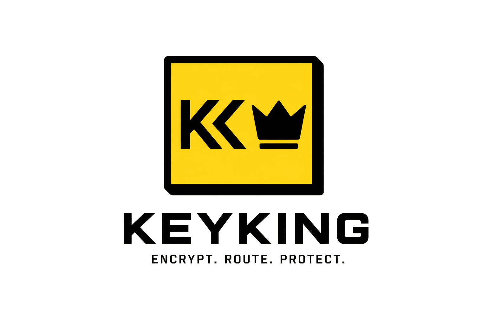
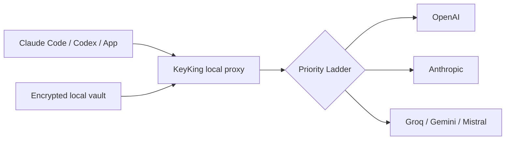

<div align="center">
  

# KeyKing AI

**The local AI gateway that securely manages your AI API keys.**

Store provider keys in an encrypted local vault. Use one OpenAI-compatible endpoint. Automatically fail over between providers and models.

[Website](https://keyking.ledgion.in) · [Documentation](https://keyking.ledgion.in/docs) · [Download](https://github.com/Malaybhai11/keyking/releases/latest) · [Security model](https://keyking.ledgion.in/security)
</div>

## Why KeyKing AI?

- **Local key custody** — provider credentials are encrypted on your machine.
- **One endpoint** — connect OpenAI-compatible apps to `http://127.0.0.1:8787/v1`.
- **Priority fallback** — order explicit provider/model pairs and fail over after eligible errors.
- **Coding-agent workflows** — adapters and wrappers for Claude Code and OpenAI Codex.
- **Multiple providers** — route user-supplied credentials for OpenAI, Anthropic, Groq, Gemini, Mistral, and others.
- **Serverless option** — use the TypeScript `keyking-sdk` with an exported encrypted vault.

> KeyKing AI is a gateway, not an LLM provider. It does not create unlimited third-party tokens. You bring the credentials and quotas you are authorized to use.

## Install the desktop gateway

macOS / Linux:

```bash
curl -fsSL https://keyking.ledgion.in/install.sh | bash
```

Windows and packaged desktop releases:

```text
https://github.com/Malaybhai11/keyking/releases/latest
```

Start the local proxy, then point an OpenAI-compatible client at KeyKing:

```ts
import OpenAI from "openai";

const client = new OpenAI({
  baseURL: "http://127.0.0.1:8787/v1",
  apiKey: "your-local-keyking-token",
});

const response = await client.chat.completions.create({
  model: "gpt-4o",
  messages: [{ role: "user", content: "Hello from KeyKing AI" }],
});
```

## Priority Ladder

The Priority Ladder is KeyKing's ordered fallback chain. Use explicit provider/model pairs:

```ts
import { KeyKing } from "keyking-sdk";

const keyking = new KeyKing({
  vault: process.env.KEYKING_VAULT,
  password: process.env.KEYKING_PASSWORD,
  routingRules: [
    { provider: "Groq", model: "llama-3.3-70b-versatile" },
    { provider: "Anthropic", model: "claude-3-5-sonnet-20241022" },
    { provider: "OpenAI", model: "gpt-4o" },
  ],
});
```

When the active route hits an eligible rate limit or upstream failure, KeyKing tries the next configured route.

## Architecture


```mermaid
flowchart LR
  A[Claude Code / Codex / App] --> B[KeyKing local proxy]
  V[Encrypted local vault] --> B
  B --> C{Priority Ladder}
  C --> D[OpenAI]
  C --> E[Anthropic]
  C --> F[Groq / Gemini / Mistral]
```

- Desktop: Tauri + Rust + React
- Local proxy: Axum + Tokio
- Vault encryption: AES-256-GCM
- Password derivation: PBKDF2-HMAC-SHA256
- Web and docs: Next.js
- Serverless package: `keyking-sdk`

## Compatibility routes

| Interface | Local route |
|---|---|
| OpenAI Chat Completions | `/v1/chat/completions` |
| OpenAI Responses / Codex | `/v1/responses` |
| Anthropic Messages / Claude Code | `/v1/messages` |

## Security boundaries

Provider credentials are encrypted at rest in the local vault and decrypted when required to call the selected upstream provider. The selected provider necessarily receives the prompt and authentication credential required to serve the request. KeyKing cannot protect a compromised host from malware or an attacker with sufficient local access.

Read the [full security explanation](https://keyking.ledgion.in/security) and repository [security checklist](SECURITY.md).

## Documentation

- [AI API key manager overview](https://keyking.ledgion.in/ai-api-key-manager)
- [Use Claude Code with KeyKing AI](https://keyking.ledgion.in/guides/claude-code)
- [KeyKing AI vs LiteLLM](https://keyking.ledgion.in/compare/litellm)
- [Machine-readable LLM context](https://keyking.ledgion.in/llms.txt)

## Contributing

Issues and pull requests are welcome. Please avoid including real credentials, vault passwords, or private request content in reports and test fixtures.

<div align="center"><strong>KeyKing AI — your AI keys, one local endpoint, automatic fallback.</strong></div>
